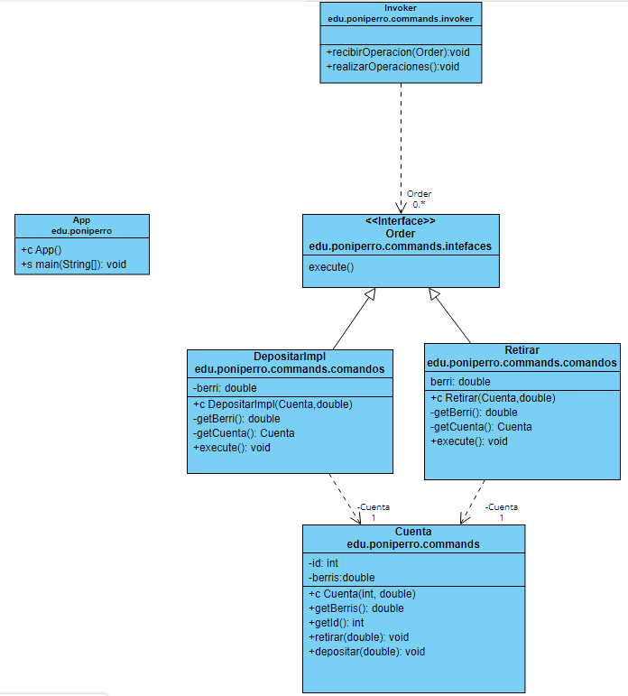
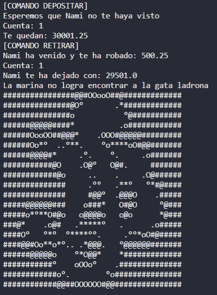

# Command_pattern_berris

Ejercicio custom para realizar una pequeña practica del Command Design Pattern.

Este patron de diseño encapsula una solicitud como un objeto, permitiendo así parametrizar otros objetos con diferentes solicitudes, encolar o guardar traza de solicitudes y dar soporte a operaciones de deshacer.

---

# SPOILER ALERT ONE PIECE

## Enunciado

Tras la subida de recompensas de la nueva generacion de piratas, y el aumento de ellos tras la muerte de Barbablanca han aumentado el numero de cazarrecompensas.

La Marina hizo un pacto con el Gobierno Mundial para crear un banco para que los cazarrecompensas pudieran guardar el dinero , dicho banco tambien era interesante para los piratas, pero dada su dificultad de acceso a la tripulante Nami se le ocurrio hacer uno para los piratas.

Asi que a ti como ingeniero del barco "Franky" te han pueso a preparar el funcionamiento de la logica, pero tranquilo tu gran compañero Usopp te ha proporcinado un diseño UML para que no estes golpeando sin ton ni son.

_Diagrama realizado conlas linas manitas de Usopp_

Una vez te dio el main , te dejo tranquilo trabajando y te especificó que queria una salida por consola parecida a esta:

He realizado este ejemplo de Command Patter gracias a este [video](https://www.youtube.com/watch?v=hDBOfyzFKEU)
